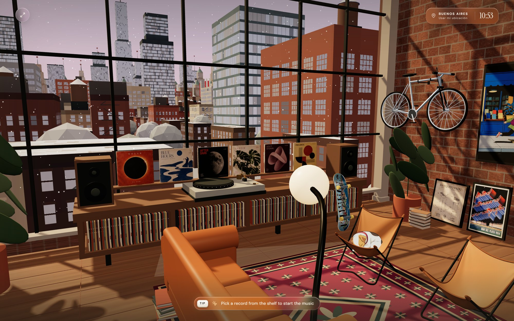
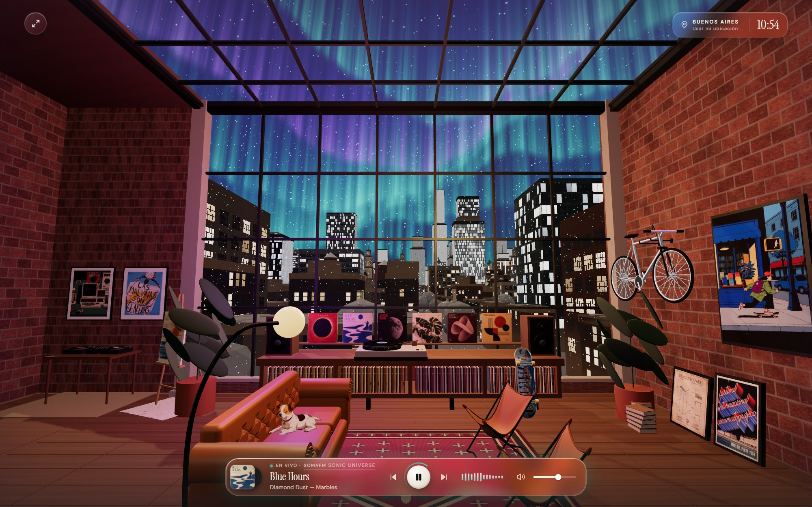
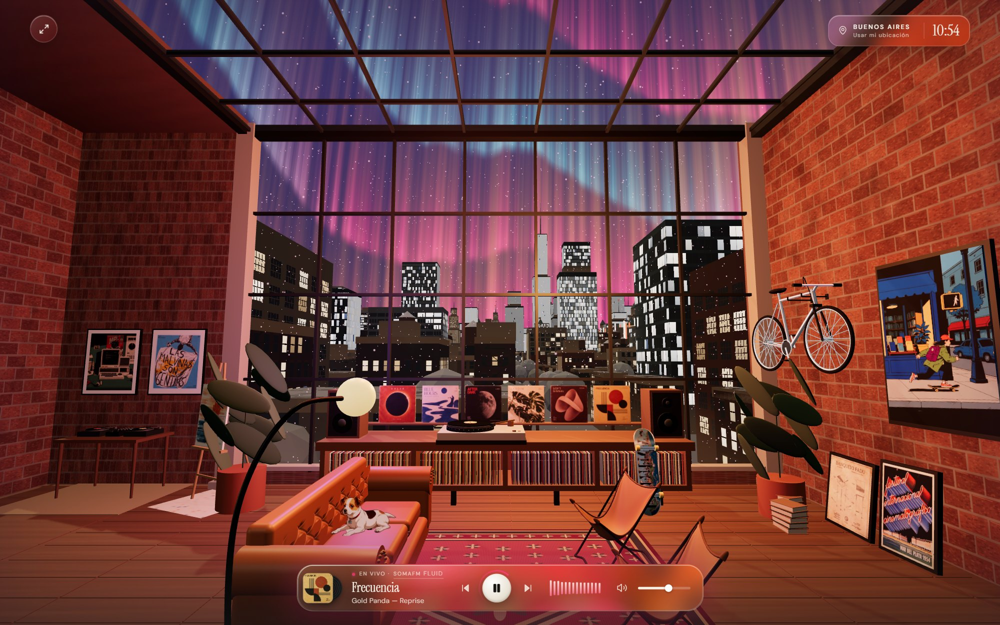
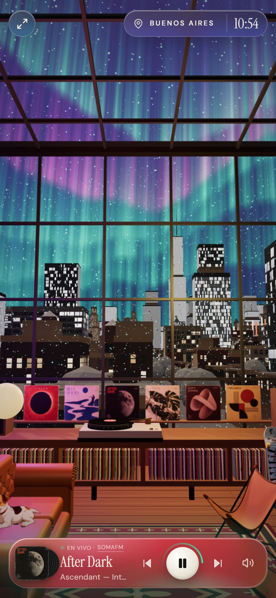
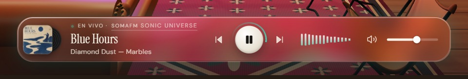

# Lo Fi Studio

Un estudio para trabajar con música de fondo. Entrás a un loft en Brooklyn, elegís un vinilo de la consola y, mientras suena, afuera cae nieve y una aurora se mueve al ritmo de la música. La idea es simple: tener una compañía visual y sonora tranquila, que acompañe horas de concentración sin pedir atención.



## Para qué sirve

- **Poner música sin pensar.** Seis discos, seis climas. Un clic y suena; anterior y siguiente cambian de disco.
- **Tener un paisaje que respira.** La escena reacciona a lo que suena: la aurora cambia de color y de energía con cada disco y late con los golpes de la música. La ciudad pasa del atardecer a la noche y se le prenden las ventanas.
- **Saber dónde y cuándo estás.** La hora local siempre a la vista; si lo permitís, también tu ciudad y el clima.
- **Dejarla sonando.** La música sigue con la pestaña en segundo plano y responde a las teclas multimedia del sistema.

## Cómo se usa

1. Esperá a que la cámara entre al estudio.
2. Elegí una portada de la consola. El disco viaja al tocadiscos y, cuando baja el brazo, empieza a sonar.
3. Usá el reproductor de abajo: pausa, disco anterior o siguiente, volumen.

Atajos: `Espacio` pausa o reanuda · `←` `→` cambian de disco · `M` silencia · `F` pantalla completa (también con el botón de arriba a la izquierda).

## Capturas

Cada disco cambia el clima: los colores y la energía de la aurora siguen a la música que suena.

| Blue Hours · jazz en Sonic Universe | Frecuencia · hip hop instrumental en Fluid |
|---|---|
|  |  |

<p align="center">
  
</p>

El reproductor muestra el disco, el canal en vivo y el tema que está sonando:



## Los discos

Los discos son ficticios; cada uno suena como un canal en vivo de [SomaFM](https://somafm.com), una radio independiente sin publicidad sostenida por sus oyentes.

| Disco | Canal de SomaFM | Clima |
|---|---|---|
| Solar | Groove Salad | ambient y downtempo |
| Blue Hours | Sonic Universe | jazz |
| After Dark | Deep Space One | ambient espacial |
| Jardín | Illinois Street Lounge | lounge |
| Soft Signal | Space Station Soma | electrónica espacial |
| Frecuencia | Fluid | hip hop instrumental |

El reproductor muestra qué tema está sonando y enlaza al canal. Si no hay conexión, suena un loop ambiental generado en el navegador para que el estudio no quede en silencio.

## Privacidad

La app no tiene cuentas ni backend. Hasta que tocás el cartel de ubicación, la ciudad se deduce de la zona horaria del dispositivo y no sale nada del navegador. Si aceptás compartir tu ubicación, las coordenadas se redondean a ~1 km y se consultan [Open-Meteo](https://open-meteo.com) (clima) y [BigDataCloud](https://www.bigdatacloud.com) (nombre de la ciudad). El volumen y la última ubicación se guardan solo en tu navegador.

## Ejecutar

```sh
npm install
npm run dev
```

Abrir http://127.0.0.1:3000. `npm run build` compila para producción y `npm run typecheck` verifica TypeScript.

> La vista previa integrada de la app de escritorio de Claude no puede reproducir las radios (SomaFM bloquea ese navegador); probala en Chrome, Edge, Safari o Firefox.

## Cómo está hecho

Next.js y React con una escena 3D en Three.js construida por código: no hay modelos ni videos de fondo. La ciudad, la nieve, la aurora y parte de los cuadros se generan en tiempo real; el audio pasa por la Web Audio API para que la escena pueda escucharlo. Funciona en celular, tablet y escritorio, se puede usar con teclado y respeta la preferencia de reducir movimiento.

- `app/loft.tsx` — escena, cámara, luces y animación del disco
- `app/city.ts`, `app/snow.ts`, `app/aurora.ts` — el exterior
- `app/lounge.ts`, `app/workspace.ts`, `app/gallery.ts`, `app/architecture.ts`, `app/rides.ts` — el interior
- `app/dog.ts` — el perro del living
- `app/solar.tsx`, `app/dock.tsx` — audio y reproductor
- `app/place.tsx` — ciudad, clima y hora
- `app/moods.ts` — el clima visual de cada disco
- `app/records.ts` — discos y canales

Las portadas son arte original generado con IA (prompt en `IMAGE-PROMPT.md`). `MUSIC-PIPELINE.md` describe una alternativa en pausa para generar música original con ComfyUI.

## Créditos

- **Radio:** [SomaFM](https://somafm.com), canales en vivo sostenidos por sus oyentes.
- **Clima y ubicación** (solo si lo activás): [Open-Meteo](https://open-meteo.com) y [BigDataCloud](https://www.bigdatacloud.com).
- **El perro:** ilustraciones generadas con IA en ComfyUI local con el modelo [Anima](https://huggingface.co/circlestone-labs) y animadas en la escena. El proceso está en `scripts/art/` y `art/`.
- **Cuadros de terceros** (`public/art/`), usados como homenaje; sus derechos son de sus autores:
  - *Banquito FADU*: lámina de @fedeetorres.
  - *Festival Internacional de Cine de Mar del Plata, 1954*: afiche histórico del festival.
  - *Las Malvinas son argentinas*: afiche de Todo Bien Posta.
  - *Skate* y *Compu*: ilustraciones de autoría a confirmar.
  - Gráfica de la tabla de skate (*Mar del Plata*): autoría a confirmar.

  Si sos autor/a de alguna y querés que se cambie el crédito o se retire, abrí un issue.
